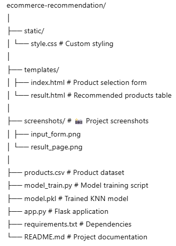
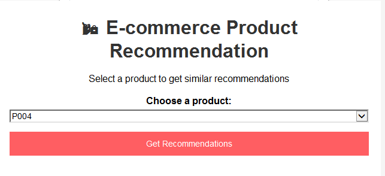
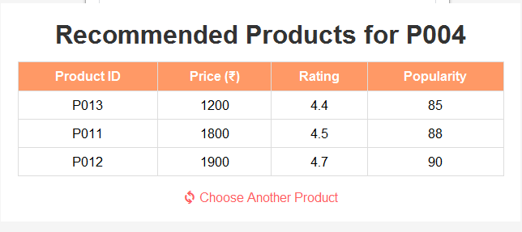

# 🛒 E-commerce Product Recommendation System (KNN)

A **Flask-based Machine Learning web application** that recommends **similar products** to customers based on product features like price, rating, popularity, category, and brand.  
The recommendation engine is powered by **K-Nearest Neighbors (KNN)**.

---

## 🔍 Overview
In e-commerce, product recommendations improve customer engagement and sales.  
This project uses **KNN similarity search** to find and display products most similar to the one selected by a user.

The system:
- Takes a **selected product** from the dropdown
- Finds **N most similar products** using Euclidean distance
- Displays them in a **clean, responsive table**

---

## ✨ Features
- 📌 Recommends **similar products** instantly
- 🤖 Uses **K-Nearest Neighbors** for recommendations
- 📂 Dataset in CSV format for easy updates
- 🖥 Clean, **responsive frontend** built with HTML & CSS
- ⚡ Real-time recommendations using Flask

---

## 🛠 Tech Stack
- **Python 3.10+**
- **Flask**
- **scikit-learn**
- **pandas**
- **HTML/CSS**

---

## 📂 Project Structure

---

## ⚙ Installation & Setup

### 1️⃣ Clone the Repository

git clone https://github.com/yourusername/ecommerce-recommendation.git
cd ecommerce-recommendation

### 2️⃣ Install Dependencies

pip install -r requirements.txt
### 3️⃣ Train the Model

python model_train.py
This will generate model.pkl.

### 4️⃣ Run the Web App

python app.py
Open in your browser:

http://127.0.0.1:5000/
## 📸 Screenshots

### 🖥 Input Form

### 📊 Prediction Result

### 💡 Use Cases
🛍 E-commerce platforms for product recommendations

📊 Retail analytics tools

🎓 Machine Learning educational projects

### 📌 Future Enhancements
Add content-based filtering with product descriptions

Allow multiple product comparisons

Deploy online using Heroku or Render
